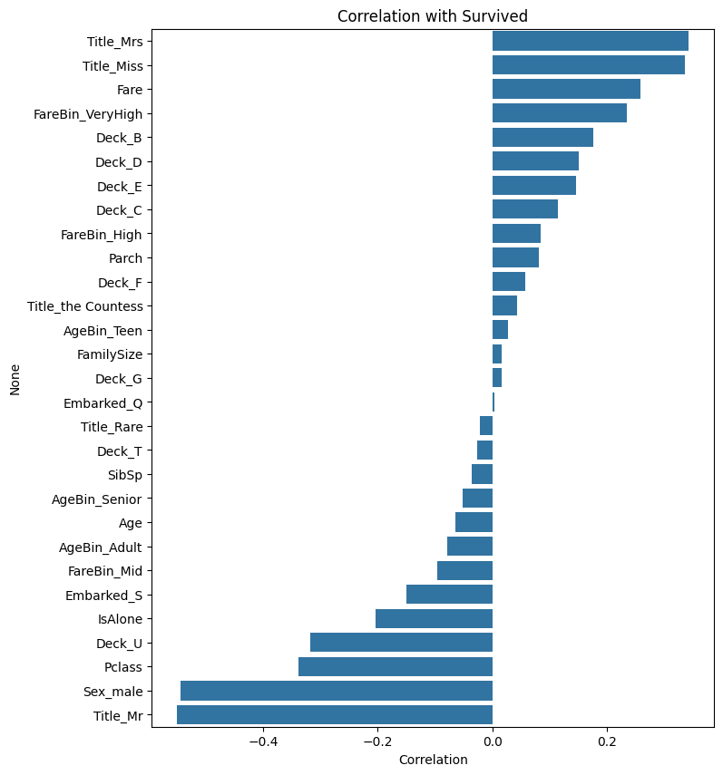
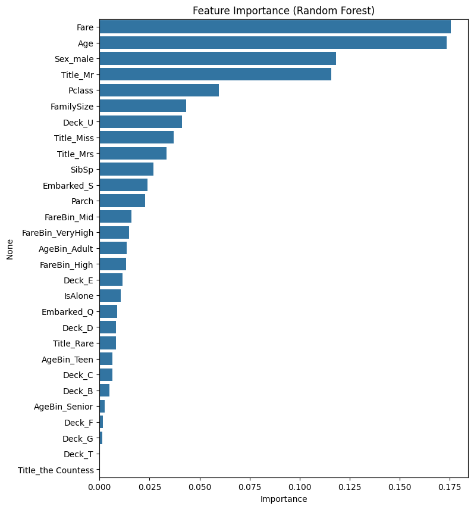
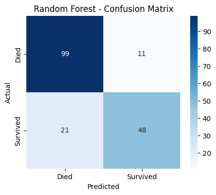

# Titanic Survival Prediction — Feature Engineering

**ML Internship Task | Hecta AI Solution**

A feature engineering and classification project built on the Kaggle Titanic dataset, covering data cleaning, feature creation, feature selection, and model evaluation against a baseline.

---

## 📌 Overview

This project applies structured feature engineering to the Titanic dataset to predict passenger survival. Rather than feeding raw columns into a model, new features are engineered from existing ones (e.g. extracting titles from names, grouping family size, binning age and fare) to give the model stronger, more meaningful signal.

The solution is built as a single, easy-to-follow Google Colab notebook, with an accompanying Word document that explains the reasoning behind every step.

---

## 📁 Dataset

**Titanic - Machine Learning from Disaster** ([Kaggle](https://www.kaggle.com/competitions/titanic))

The Kaggle download is a zip file containing:

| File | Description |
|---|---|
| `train.csv` | Labeled data (includes `Survived`) — used for training and evaluation |
| `test.csv` | Unlabeled data — used only for Kaggle competition submission |
| `gender_submission.csv` | Example submission format — not used in this project |

Only `train.csv` is used here, since it's the only file with ground-truth labels.

---

## 📦 Repository Contents

```
├── Titanic_Feature_Engineering.ipynb   # Main Colab notebook (data cleaning → model comparison)
├── Titanic_Code_Explanation.docx       # Plain-language walkthrough of the notebook
├── assets/
│   ├── correlation_with_survived.png   # Feature correlation bar chart
│   ├── feature_importance.png          # Random Forest feature importance bar chart
│   └── confusion_matrix.png            # Random Forest confusion matrix
└── README.md                           # This file
```

---

## ⚙️ Setup & Usage

1. Download the dataset zip from the [Kaggle Titanic competition page](https://www.kaggle.com/competitions/titanic/data).
2. Upload the zip file (e.g. `titanic.zip`) to your Google Drive — no need to extract it yourself.
3. Open `Titanic_Feature_Engineering.ipynb` in [Google Colab](https://colab.research.google.com/).
4. Update the `zip_path` variable to match where you uploaded the file in Drive.
5. Run all cells top to bottom.

No local setup or `requirements.txt` is needed — the notebook runs entirely in Colab using pre-installed libraries (`pandas`, `numpy`, `scikit-learn`, `matplotlib`, `seaborn`).

---

## 🧭 Workflow

### 1. Data Loading
Mounts Google Drive, extracts the dataset zip, and loads `train.csv`.

### 2. Data Cleaning
- `Age` → filled with median
- `Embarked` → filled with mode
- `Fare` → filled with median

### 3. Feature Engineering
| Feature | Description |
|---|---|
| `Title` | Extracted from `Name` (Mr, Mrs, Miss, Master, Rare) |
| `FamilySize` | `SibSp + Parch + 1` |
| `IsAlone` | 1 if travelling with no family, else 0 |
| `Deck` | First letter of `Cabin` (`U` if unknown) |
| `AgeBin` | Age grouped into Child / Teen / Adult / Senior |
| `FareBin` | Fare split into 4 quartile-based groups |

### 4. Encoding
Categorical columns are one-hot encoded (`pd.get_dummies`, `drop_first=True`).

### 5. Feature Selection
- Correlation of each feature with `Survived`
- Feature importance from a Random Forest, visualized as bar charts

### 6. Modeling
- **Baseline:** Logistic Regression
- **Main model:** Random Forest Classifier

### 7. Evaluation
Accuracy, classification report, confusion matrix, and a final baseline-vs-main-model comparison table.

---

## 📊 Results

### Feature correlation with survival



The signs here tell the whole story before any model is even trained. `Title_Mr` and `Sex_male` are the two strongest negative correlations — being a man was close to a death sentence on the Titanic, full stop. `Title_Mrs` and `Title_Miss` sit at the top as the strongest positive correlations, which is really just the same fact restated: women survived at much higher rates. `Fare` and `FareBin_VeryHigh` also correlate positively, which lines up with wealthier passengers being closer to lifeboats. `Pclass` correlates negatively, as expected — 3rd class had the worst odds. None of this is a coincidence; it matches the well-documented "women and children first, upper class first" pattern from the actual disaster.

### Feature importance (Random Forest)



> Save the chart produced by the "Random Forest feature importance" cell in the notebook as `assets/feature_importance.png` to render it here.

Correlation tells you what moves together with the outcome; feature importance tells you what the trained model is *actually using* to split its decision trees, and the two don't always agree. Expect `Sex`/`Title` and `Fare`/`Pclass` to dominate here as well, since they're the strongest linear signals — but engineered features like `FamilySize`, `Deck`, and the age/fare bins are the ones worth watching. If they show up with non-trivial importance despite weak correlation, that's the Random Forest picking up non-linear interactions a correlation coefficient can't see (e.g. small families surviving more than solo travelers *or* large families, not a straight line). If an engineered feature ranks near zero on both metrics, it's a candidate to drop in a future iteration — it's adding model complexity without adding signal.

### Confusion matrix (Random Forest, test set)



| | Predicted Died | Predicted Survived |
|---|---|---|
| **Actual Died** | 99 | 11 |
| **Actual Survived** | 21 | 48 |

From this test split (179 passengers):

- **Accuracy:** (99 + 48) / 179 ≈ **82.1%**
- **Precision (Survived):** 48 / (48 + 11) ≈ **81.4%** — when the model predicts survival, it's right about 4 out of 5 times
- **Recall (Survived):** 48 / (48 + 21) ≈ **69.6%** — the model misses about 3 in 10 survivors, calling them dead when they weren't

The model is noticeably better at identifying passengers who died (99/110 correct) than passengers who survived (48/69 correct). That asymmetry is expected — "died" is the majority class in this dataset (~62%), so the model has more examples to learn that pattern from, and the cost function isn't weighted to compensate. If recall on the survived class mattered more for the use case, the next step would be `class_weight='balanced'` on the Random Forest or adjusting the decision threshold rather than accepting the default 0.5 cutoff.

**Baseline comparison:** Logistic Regression is trained on the same features as a sanity check. Random Forest wins by a modest margin — feature engineering did most of the heavy lifting here; the model choice mattered less than getting `Title`, `Sex`, and `Pclass` correctly represented.

---

## 🛠️ Tech Stack

- Python 3
- pandas, numpy
- scikit-learn
- matplotlib, seaborn
- Google Colab / Google Drive

---

## ✅ Notes

- Code is written to be simple and readable — plain pandas operations, no helper functions or extra abstractions — so each step is easy to follow in Colab.
- See `Titanic_Code_Explanation.docx` for a detailed, plain-language explanation of what each code cell does and why.

---

## 👤 Author

**Abdul Haseeb**
BS Artificial Intelligence, IBADAT International University, Islamabad
AI/ML Intern — Hecta AI Solution
[GitHub: ahaseeb003](https://github.com/ahaseeb003)